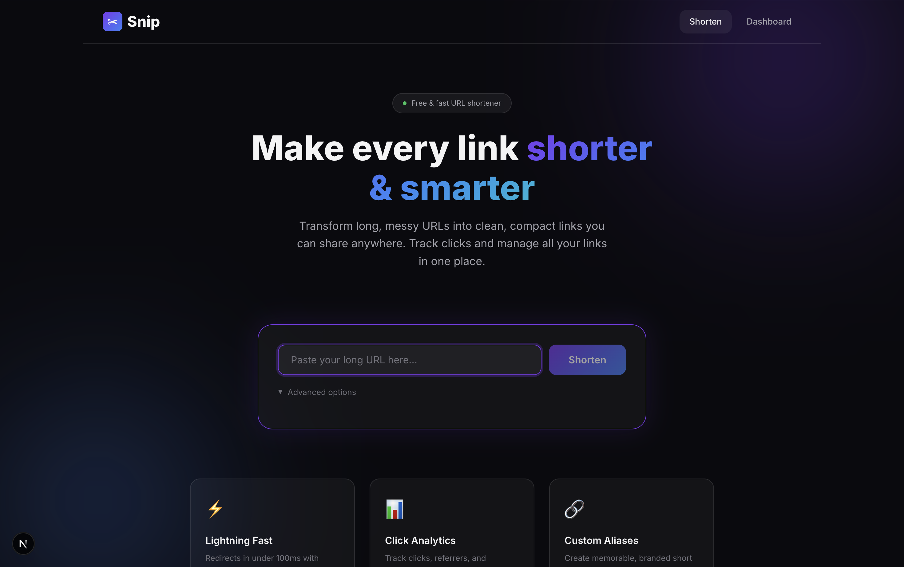
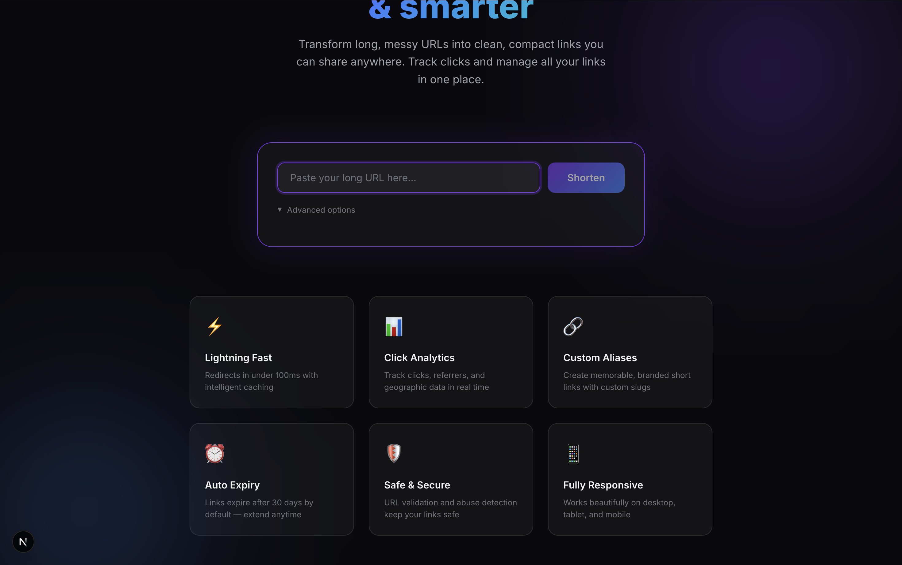
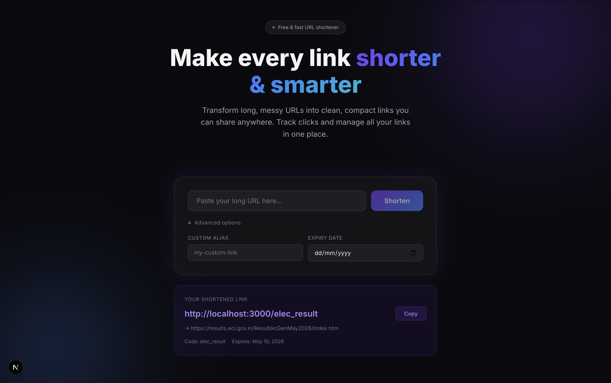
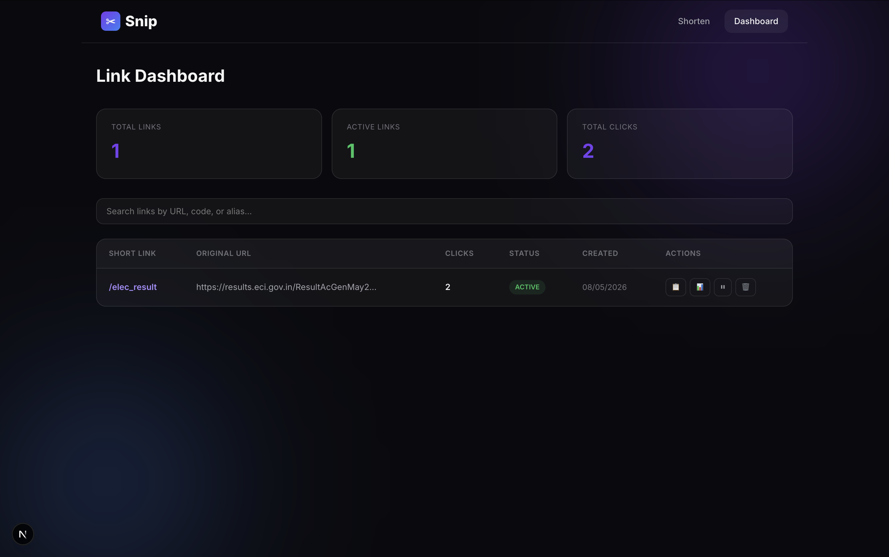

# ✂️ Snip — URL Shortener

A lightweight, premium URL shortening service built with Next.js. Transform long URLs into compact, shareable links with click tracking and analytics.

## Architecture



## Screenshots









## Features

- **⚡ Instant Shortening** — Paste a URL and get a short link in under a second
- **🔗 Custom Aliases** — Create branded short links like `/my-brand`
- **📊 Click Analytics** — Track clicks, referrers, and geographic data per link
- **⏰ Auto Expiry** — Links expire after 30 days by default (configurable)
- **📱 Responsive** — Works beautifully on desktop, tablet, and mobile
- **🛡️ Rate Limited** — 10 links/hour for anonymous users

## Tech Stack

| Layer | Technology |
|-------|-----------|
| Frontend | Next.js 16 (React 19), App Router |
| Styling | Vanilla CSS (dark mode, glassmorphism) |
| Database | Supabase (PostgreSQL) via node-postgres |
| Cache | In-memory LRU (Redis stand-in for v1) |
| Font | Inter (Google Fonts) |

## Quick Start

```bash
# Install dependencies
npm install

# Start development server
npm run dev

# Open http://localhost:3000
```

## Project Structure

```
src/
├── app/
│   ├── layout.js              # Root layout
│   ├── page.js                # Home — URL shortening
│   ├── globals.css            # Design system
│   ├── [code]/route.js        # Redirect handler (GET /:code → 302)
│   ├── dashboard/page.js      # Link management + analytics
│   └── api/
│       ├── shorten/route.js   # POST: create short link
│       ├── links/route.js     # GET: list links
│       ├── links/[id]/route.js # PUT/DELETE: manage link
│       └── analytics/[code]/route.js # GET: click analytics
├── lib/
│   ├── db.js                  # PostgreSQL connection & schema
│   ├── cache.js               # LRU cache (Redis substitute)
│   ├── shortcode.js           # Base-62 short code generation
│   ├── validators.js          # URL validation
│   └── rate-limit.js          # Rate limiting
└── components/
    ├── Header.js
    ├── ShortenForm.js
    └── LinkResult.js
```

## API Reference

| Method | Endpoint | Description |
|--------|----------|-------------|
| `POST` | `/api/shorten` | Create a short link |
| `GET` | `/api/links` | List all links (paginated) |
| `GET` | `/api/links/:id` | Get single link details |
| `PUT` | `/api/links/:id` | Update link (alias, expiry, active) |
| `DELETE` | `/api/links/:id` | Delete a link |
| `GET` | `/api/analytics/:code` | Get click analytics for a link |
| `GET` | `/:code` | Redirect to original URL (302) |

## Roadmap

- [ ] Persistent Redis cache
- [ ] User authentication
- [ ] Custom domains
- [ ] QR code generation

## License

MIT